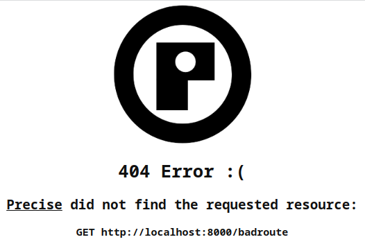

[](https://deno.land/x/precise)
[](https://doc.deno.land/https/deno.land/x/precise/mod.ts)
[](https://github.com/openhoat/deno-precise/actions/workflows/build.yml)
[](https://app.codecov.io/openhoat/openhoat/deno-precise)
[](https://velociraptor.run)
[](https://github.com/openhoat/deno-precise/blob/master/LICENSE)

# Precise

A clean and easy web server powered by Deno.

## Getting started

### The stupid example

Let's start a totally useless web server!

[`demo/sample0.ts`](demo/sample0.ts):

```typescript
import { WebServer } from 'https://deno.land/x/precise/mod.ts'

await new WebServer().start()
```

> - No config / middleware / handler registered
> - The server will just apply the 'not found' fallback

Run the server:

```shell
$ deno run demo/sample0.ts
34:513 [Info    ] Logging session initialized. Initial logger min log level: Debug (programmatically set)
34:514 [Info    ] Create web server
34:514 [Info    ] Start server
34:514 [Info    ] Accept connection
34:514 [Info    ] Waiting for new connection
34:515 [Info    ] Web server running. Access it at: http://localhost:8000/
```

Request with a browser:



Request with a text plain compliant User Agent:

```shell
$ http :8000/badroute "Accept:text/plain"
HTTP/1.1 404 Not Found
content-encoding: gzip
content-length: 79
content-type: text/plain;charset=UTF-8
date: Thu, 10 Nov 2022 18:29:47 GMT
vary: Accept-Encoding

Resource 'GET http://localhost:8000/badroute' not found.

$ █
```

Request with a JSON compliant User Agent:

```shell
✗ http :8000/badroute "Accept:application/json"
HTTP/1.1 404 Not Found
content-encoding: gzip
content-length: 91
content-type: application/json
date: Thu, 10 Nov 2022 18:30:09 GMT
vary: Accept-Encoding

{
    "error": "Resource 'GET http://localhost:8000/badroute' not found."
}

$ █
```

### The minimal example

[`demo/sample1.ts`](demo/sample1.ts):

```typescript
import { WebServer } from 'https://deno.land/x/precise/mod.ts'

await new WebServer()
  .register({
    path: '/',
    handler: () => ({ foo: 'bar' }),
  })
  .start()
```

> A request handler can return either:
>
> - nothing: the server will not send any response.
> - a [JSON literal object](https://developer.mozilla.org/en-US/docs/Web/JavaScript/Reference/Operators/Object_initializer):
>   the server will send a JSON content HTTP response.
> - a [BodyInit](https://deno.land/api@v1.27.2?s=BodyInit): the server will send a wrapped response on top of the
>   provided body.
> - a [Response](https://deno.com/deploy/docs/runtime-response): the server will send the given response.
> - [Promise](https://developer.mozilla.org/en-US/docs/Web/JavaScript/Reference/Global_Objects/Promise) of the aboves:
>   the server will resolve the promise and apply the aboves strategies.

Run the server:

```shell
$ deno run demo/sample1.ts
39:043 [Info    ] Logging session initialized. Initial logger min log level: Debug (programmatically set)
39:043 [Info    ] Create web server
39:044 [Info    ] Register 'handler' on route 'GET /'
39:044 [Info    ] Start server
✅ Granted env access to "PORT".
✅ Granted net access to "0.0.0.0:8000".
39:044 [Info    ] Accept connection
39:044 [Info    ] Waiting for new connection
39:044 [Info    ] Web server running. Access it at: http://localhost:8000/
$ █
```

Request:

```shell
$ http :8000
HTTP/1.1 200 OK
content-length: 13
content-type: application/json
date: Wed, 09 Nov 2022 07:02:46 GMT
vary: Accept-Encoding

{
    "foo": "bar"
}

$ █
```

Server logs:

```text
…
54:006 [Info    ] Handle connection
54:006 [Info    ] Waiting for new request in connection#5
54:006 [Info    ] Waiting for new connection
54:007 [Info    ] Handle request
54:007 [Debug   ] Request 'GET /' matches route 'GET /': apply handler 'handler'
54:008 [Info    ] Waiting for new request in connection#5
54:010 [Debug   ] No more request pending for connection#5
54:010 [Info    ] End processing request in connection#5
```

## Why

This project has been created because of the lack of a stop method in Http Deno and the others third party modules.

I wanted a simple web server service, that starts, registers, and stops, and don't want to deal with 2 imbricated async
iterator loops ([serving-http](https://deno.land/manual@v1.26.2/runtime/http_server_apis_low_level#serving-http)).

This project was created with some strong principles in mind, which can be mainly summarized
by [DX](https://developerexperience.io/):

- Quality
- Testing
- Clean and easy understandable API
- Async / Promise compliant everywhere
- Robust: all is done to be sure that in any situation the server will have a fair behaviour and will report enough logs

## Features

- [x] [Basic service lifecycle](#why)
- [x] [Route matching](#the-minimal-example)
- [x] [Signal handling](#signals-handling)
- [x] [Route params](#route-params)
- [x] [Middlewares](#middlewares)
- [x] [Routers](#routers)
- [x] [Logging](#logging)

### Signals handling

Use signals handling to gracefully shutdown the web server.

[`demo/sample2.ts`](demo/sample2.ts):

```typescript
import { WebServer, shutdownOnSignals } from 'https://deno.land/x/precise/mod.ts'

const webServer = new WebServer()
shutdownOnSignals(webServer)
webServer.register({
  path: '/',
  handler: () => ({ foo: 'bar' }),
})
await webServer.start()
```

Run the server:

```shell
$ deno run demo/sample2.ts
17:393 [Info    ] Logging session initialized. Initial logger min log level: Debug (programmatically set)
17:393 [Info    ] Create web server
17:393 [Info    ] Register 'handler' on route 'GET /'
17:393 [Info    ] Start server
✅ Granted env access to "PORT".
✅ Granted net access to "0.0.0.0:8000".
19:941 [Info    ] Accept connection
19:941 [Info    ] Waiting for new connection
19:941 [Info    ] Web server running. Access it at: http://localhost:8000/
19:942 [Debug   ] Handling signal SIGINT
19:942 [Debug   ] Handling signal SIGTERM
19:942 [Debug   ] Handling signal SIGQUIT
19:942 [Info    ] Type 'kill -s SIGINT 16415' to stop
```

Stop the server:

```shell
$ kill -s SIGINT 16415
$ █
```

Server logs:

```text
…
25:975 [Warn    ] Received signal SIGINT
25:975 [Info    ] Stop server
25:975 [Warn    ] Listener has been closed
25:975 [Info    ] End processing connection
25:976 [Info    ] Logging session complete.  Duration: 68584ms
$ █
```

> The server is properly stopped without the need to Deno.exit(),
> so that it can be used cleanly into end-to-end tests.

### Route params

Handle routes parameters:

[`demo/sample3.ts`](demo/sample3.ts):

```typescript
import { WebServer, shutdownOnSignals } from 'https://deno.land/x/precise/mod.ts'

const webServer = new WebServer()
shutdownOnSignals(webServer)
const { logger } = webServer
webServer.register({
  method: 'POST',
  path: '/execute/:cmd',
  handler: (req) => {
    if (req.params?.cmd === 'stop') {
      setTimeout(async () => {
        try {
          await webServer.stop()
        } catch (err) {
          logger.error(err)
          Deno.exit(1)
        }
      }, 1000)
      return new Response(undefined, { status: 202 })
    }
    return { foo: 'bar' }
  },
})

try {
  await webServer.start()
} catch (err) {
  logger.error(err)
  Deno.exit(1)
}
```

Request:

```shell
$ http post :8000/execute/stop
HTTP/1.1 202 Accepted
content-length: 0
date: Wed, 09 Nov 2022 08:37:53 GMT
vary: Accept-Encoding

$ █
```

Server logs:

```text
02:742 [Info    ] Handle connection
02:743 [Info    ] Waiting for new request in connection#8
02:743 [Info    ] Waiting for new connection
02:743 [Info    ] Handle request
02:744 [Debug   ] Request 'POST /execute/stop' matches route 'POST /execute/:cmd': apply handler 'handler'
02:744 [Info    ] Waiting for new request in connection#8
02:746 [Debug   ] No more request pending for connection#8
02:746 [Info    ] End processing request in connection#8
03:745 [Info    ] Stop server
03:745 [Warn    ] Listener has been closed
03:745 [Info    ] End processing connection
03:746 [Info    ] Logging session complete.  Duration: 27074ms
$ █
```

### Fallbacks

In case of a not found resource or an error, defaults handler are applied.

Feel free to use custom not found and error handlers.

[`demo/sample4.ts`](demo/sample4.ts):

```typescript
import { WebServer } from 'https://deno.land/x/precise/mod.ts'

const webServer = new WebServer()
webServer.setErrorHandler((req: Request, err: Error, responseSent: boolean) => {
  if (responseSent) {
    return
  }
  return Response.json(
    {
      code: 'INTERNAL_SERVER',
      message: `Error encountered in request '${req.method} ${req.url}': ${err.message}.`,
    },
    { status: 500 },
  )
})
webServer.setNotFoundHandler((req) =>
  Response.json(
    {
      code: 'NOT_FOUND',
      message: `Resource '${req.method} ${req.url}' not found.`,
    },
    { status: 404 },
  ),
)
webServer.register({
  path: '/oops',
  handler: () => {
    throw new Error('oops')
  },
})

await webServer.start()
```

Request:

```shell
$ http :8000/myverybadroute
HTTP/1.1 404 Not Found
content-encoding: gzip
content-length: 112
content-type: application/json
date: Wed, 09 Nov 2022 15:49:01 GMT
vary: Accept-Encoding

{
  "code": "NOT_FOUND",
  "message": "Resource 'GET http://localhost:8000/myverybadroute' not found."
}

$ http :8000/oops
HTTP/1.1 500 Internal Server Error
content-encoding: gzip
content-length: 123
content-type: application/json
date: Wed, 09 Nov 2022 15:50:11 GMT
vary: Accept-Encoding

{
  "code": "INTERNAL_SERVER",
  "message": "Error encountered in request 'GET http://localhost:8000/oops': oops."
}

$ █
```

Or in a simpler all-in-one form, as in [`demo/sample5.ts`](demo/sample5.ts):

```typescript
import { WebServer } from 'https://deno.land/x/precise/mod.ts'

await new WebServer({
  errorHandler: (req: Request, err: Error, responseSent: boolean) => {
    if (responseSent) {
      return
    }
    return Response.json(
      {
        code: 'INTERNAL_SERVER',
        message: `Error encountered in request '${req.method} ${req.url}': ${err.message}.`,
      },
      { status: 500 },
    )
  },
  notFoundHandler: (req: Request) =>
    Response.json(
      {
        code: 'NOT_FOUND',
        message: `Resource '${req.method} ${req.url}' not found.`,
      },
      { status: 404 },
    ),
  handlers: [
    {
      path: '/oops',
      handler: () => {
        throw new Error('oops')
      },
    },
  ],
}).start()
```

### Middlewares

Route request handlers are part of a middlewares list enabled when the server is started.

The server will pass the request to each registered middleware in the order of their registration, then fallback to the
special 'not found' handler if no response was sent.

In case of error in any handler, the server will pass the request to the special error handler.

In the middlewares chain, each handler is executed, even if the response has already been sent ; it's the responsability
of the handler to check it and return sooner if the response was already sent.

To register a middleware handling all routes, simply omit the `path`.

[`demo/sample6.ts`](demo/sample6.ts):

```typescript
import { WebServer } from 'https://deno.land/x/precise/mod.ts'

await new WebServer({
  handlers: [
    {
      handler: function allRoutesHandler(req) {
        this.logger.warn(`The request '${req.method} ${req.url}' was here!`)
        // Do something useful with the request
      },
    },
  ],
}).start()
```

Request:

```shell
$ http :8000/
HTTP/1.1 404 Not Found
content-encoding: gzip
content-length: 71
content-type: text/plain;charset=UTF-8
date: Thu, 10 Nov 2022 09:09:59 GMT
vary: Accept-Encoding

Resource 'GET http://localhost:8000/' not found.

$ █
```

Server logs:

```text
…
59:727 [Info    ] Handle request
59:727 [Debug   ] Request 'GET /' matches route 'ALL *': apply handler 'allRoutesHandler'
59:728 [Warn    ] The request 'GET http://localhost:8000/' was here!
59:728 [Debug   ] No response sent by routes: fallback to not found handler
…
```

> It's possible to add a `method` property to refine matching criteria.

### Routers

Use routers to better organize your routes with path prefixes.

[`demo/sample7.ts`](demo/sample7.ts):

```typescript
import { WebServer } from 'https://deno.land/x/precise/mod.ts'
import { apiRouter } from './api/api_router.ts'

const webServer = new WebServer()
webServer.register(apiRouter)
await webServer.start()
```

[`demo/api/api_router.ts`](demo/api/api_router.ts):

```typescript
import { Router } from 'https://deno.land/x/precise/mod.ts'
import { v1Router } from './v1/v1_router.ts'

const apiRouter = new Router({ prefix: '/api' })
apiRouter.register(v1Router)
apiRouter.get('/health', () => ({ ok: true }))

export { apiRouter }
```

[`demo/api/v1/v1_router.ts`](demo/api/v1/v1_router.ts):

```typescript
import { Router } from 'https://deno.land/x/precise/mod.ts'

const v1Router = new Router({ prefix: '/v1' })
v1Router.get('/foo', () => {
  return { foo: 'bar' }
})
v1Router.delete('/hello', () => {
  return { message: 'bye!' }
})

export { v1Router }
```

### Logging

The web server comes with an embedded default logger based on [optic](https://deno.land/x/optic).

If you need to customize logging, just pass your custom logger into the web server options.

[`demo/sample8.ts`](demo/sample8.ts):

```typescript
import { WebServer } from 'https://deno.land/x/precise/mod.ts'
import logger from './logger.ts'

const webServer = new WebServer({ logger })
await webServer.start()
```

[`demo/logger.ts`](demo/logger.ts):

```typescript
import { TokenReplacer } from 'https://deno.land/x/optic/formatters/tokenReplacer.ts'
import { longestLevelName, nameToLevel } from 'https://deno.land/x/optic/logger/levels.ts'
import { Logger } from 'https://deno.land/x/optic/logger/logger.ts'
import { ConsoleStream } from 'https://deno.land/x/optic/streams/consoleStream.ts'

const logLevel = nameToLevel(Deno.env.get('LOG_LEVEL') ?? 'Debug')
const levelPadding = longestLevelName()
const logger = new Logger()
  .withMinLogLevel(logLevel)
  .addStream(
    new ConsoleStream().withFormat(
      new TokenReplacer()
        .withFormat('{dateTime} [{level}] {msg}')
        .withDateTimeFormat('DD hh:mm:ss:SSS')
        .withLevelPadding(levelPadding)
        .withColor(),
    ),
  )

export default logger
```

## License

The [MIT License](LICENSE)
